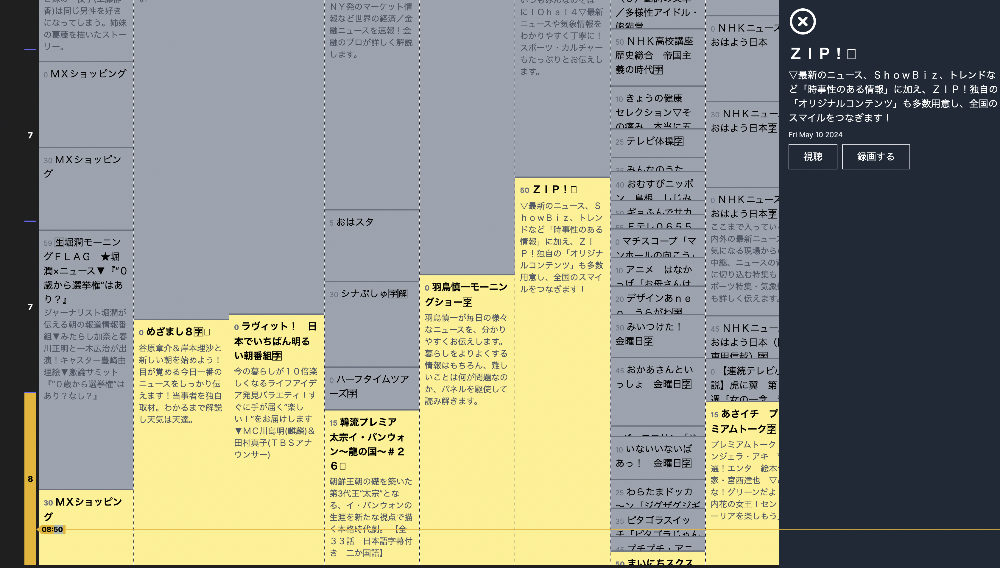
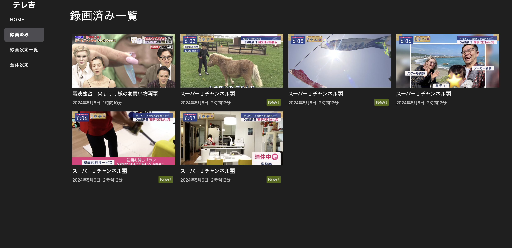
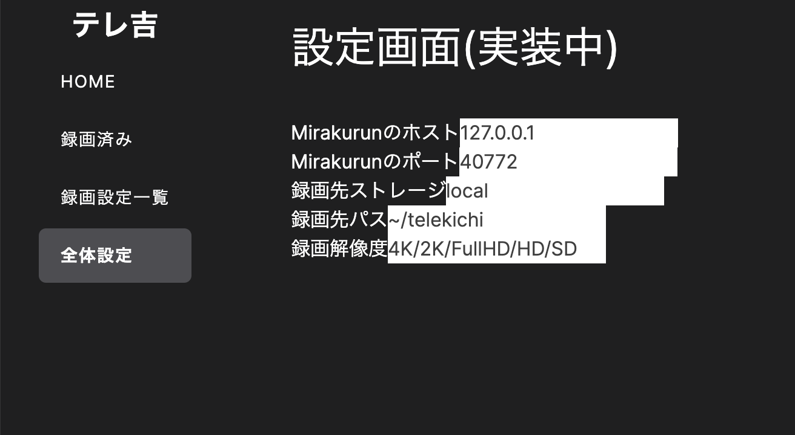

# telekichi(WIP)

テレビをPC/スマホ/出先でもっと快適に楽しむ、Webベースの視聴 & 録画クライアント。

## 開発中画面





プレーヤ/設定画面は大きく見た目が変わります↓




## アルファ版公開までの道のり

- 録画デーモンのバグ修正
- 録画保存先等を設定できるように
- 録画パラメータ(フレームレート・解像度等)の動的調整
- UIの調整
- リモートアクセス機能 -> アルファ版に乗らない可能性があります
- 片手間でやっている分全体的に実装が汚いのを緩和する

## Features

- ホームネットワーク内でのマルチデバイス再生(スマホ/PC/タブレット)対応
- 地上波/BS対応
- 番組表(EPG)あり
- もちろんリアルタイム視聴可能
- 録画機能(シーンサーチサムネイルなども充実)
- 再生中のチャンネル切り替え

## Roadmaps

- 保存先ストレージの選択ができるように
- 副音声対応
- スポーツ番組などで終了時間が延長した場合に対応
- 字幕表示(STD-B36)対応 / ARIB外字対応
- MSE/EMEでの再生に対応
- 字幕スクショのSNSシェア機能
- チューナ管理システム(Mirakurun相当)の自前開発(DVBv5 Toolsなどで)

## Dir

```text
/child_process -> 再生プロキシ / 録画デーモン
/init_db -> DBスキーマ & seed初期化
lib/telekichi -> 各種デーモン & サーバ & フロントから共通して利用できるロジック
/src -> フロント側
```

# How to start a local server for development

```bash
npm run dev
```

# Appendix

## Channel Mapping

GR:23 -> service.service_id

GR:25 -> service.id
